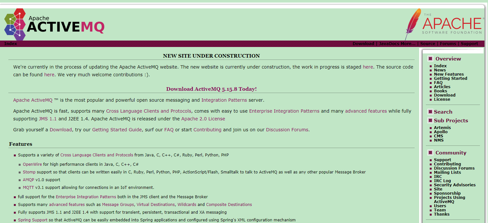
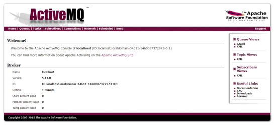

# 一、ActiveMQ简介
* ActiveMQ 是Apache出品，最流行的，能力强劲的开源消息总线。ActiveMQ 是一个完全支持JMS1.1和J2EE 1.4规范的 JMS Provider实现，尽管JMS规范出台已经是很久的事情了,但是JMS在当今的J2EE应用中间仍然扮演着特殊的地位。
* **主要特点**
    * 多种语言和协议编写客户端。语言: Java, C, C++, C#, Ruby, Perl, Python, PHP。应用协议: OpenWire,Stomp REST,WS Notification,XMPP,AMQP
    * 完全支持JMS1.1和J2EE 1.4规范 (持久化,XA消息,事务)
    * 对Spring的支持,ActiveMQ可以很容易内嵌到使用Spring的系统里面去,而且也支持Spring2.0的特性
    * 通过了常见J2EE服务器(如 Geronimo,JBoss 4, GlassFish,WebLogic)的测试,其中通过JCA 1.5 resource adaptors的配置,可以让ActiveMQ可以自动的部署到任何兼容J2EE 1.4 商业服务器上
    * 支持多种传送协议:in-VM,TCP,SSL,NIO,UDP,JGroups,JXTA
    * 支持通过JDBC和journal提供高速的消息持久化
    * 从设计上保证了高性能的集群,客户端-服务器,点对点
    * 支持Ajax
    * 支持与Axis的整合
    * 可以很容易得调用内嵌JMS provider,进行测试

# 二、ActiveMQ的消息形式
对于消息的传递有两种类型
* **一种是点对点的**，及一个生产者和一个消费者一一对应；
* **另一种是发布/订阅模式**，即一个生产者产生消息并进行发送后，可以由多个消费者进行接收。

JMS（Java Message Service）定义了五种不同的消息正文格式，以及调用的消息类型，允许你发送并接收以一些不同形式的数据，根据现有消息格式的一些级别的兼容性。
  * StreamMessage   Java原始值的数据流
  * MapMessage      一套名称-值对
  * TextMessage     一个字符串对象
  * ObjectMessage   一个序列化的Java对象
  * ByteMessage     一个字节的数据流

# 三、ActiveMQ的安装
## 3.1 下载
进入http://activemq.apache.org/ 下载ActiveMQ


## 3.2 安装
1. 由于ActiveMq为java代码编写，需要安装jdk
2. 上传到linux系统
3. 解压
4. 启动：使用bin目录下activeMq命令启动：./activemq start
5. 关闭：./activemq stop
6. 查看状态：./activemq status
7. 注意：如果ActiveMQ整合spring使用不要使用activemq-all-5.12.0.jar包。建议使用5.11.2
8. 进入管理后台：http://192.168.1.1:8161/admin 用户名：admin 密码：admin


# 四、ActiveMQ的使用
## 4.1 Queue
### 4.1.1 添加jar包至工程中
```html
<properties>
<activemq.version>5.11.2</activemq.version>
</properties>
<dependencyManagement>
  <dependencies>
    <dependency>
      <groupId>org.apache.activemq</groupId>
      <artifactId>activemq-all</artifactId>
      <version>${activemq.version}</version>
    </dependency>
  </dependencies>
</dependencyManagement>
```
### 4.1.2 Producer端测试代码
* 生产消息，发送端。
1. 创建一个ConnectionFactory对象
2. 从ConnectionFactory对象中获取Connection对象。
3. 开启连接，调用Connection对象的start方法。
4. 从Connection对象中获取Session对象
5. 使用Session对象创建一个Destination对象（topic、queue），此处创建一个Queue对象。
6. 使用Session对象创建一个Producer对象。
7. 创建一个Message对象，创建一个TextMessage对象
8. 使用Producer对象发送消息。
9. 关闭资源
```java
@Test
public void testQueueProducer() throws Exception {
  // 第一步：创建ConnectionFactory对象，需要指定服务端ip及端口号。
  //brokerURL服务器的ip及端口号
  ConnectionFactory connectionFactory = new ActiveMQConnectionFactory("tcp://192.168.1.168:61616");
  // 第二步：使用ConnectionFactory对象创建一个Connection对象。
  Connection connection = connectionFactory.createConnection();
  // 第三步：开启连接，调用Connection对象的start方法。
  connection.start();
  // 第四步：使用Connection对象创建一个Session对象。
  //第一个参数：是否开启事务。true：开启事务，第二个参数忽略。
  //第二个参数：当第一个参数为false时，才有意义。消息的应答模式。1、自动应答2、手动应答。
  Session session = connection.createSession(false, Session.AUTO_ACKNOWLEDGE);
  // 第五步：使用Session对象创建一个Destination对象（topic、queue），此处创建一个Queue对象。
  //参数：队列的名称。
  Queue queue = session.createQueue("test-queue");
  // 第六步：使用Session对象创建一个Producer对象。
  MessageProducer producer = session.createProducer(queue);
  // 第七步：创建一个Message对象，创建一个TextMessage对象。
  /*TextMessage message = new ActiveMQTextMessage();
  message.setText("hello activeMq,this is my first test.");*/
  TextMessage textMessage = session.createTextMessage("hello activeMq,this is my first test.");
  // 第八步：使用Producer对象发送消息。
  producer.send(textMessage);
  // 第九步：关闭资源。
  producer.close();
  session.close();
  connection.close();
}
```
### 4.1.3 Comsumer
* 消费者：接收消息。
1. 创建一个ConnectionFactory对象
2. 从ConnectionFactory对象中获取Connection对象。
3. 开启连接，调用Connection对象的start方法。
4. 从Connection对象中获取Session对象
5. 使用Session对象创建一个Destination对象。和发送端保持一致queue，并且队列的名称一致。
6. 使用Session对象创建一个Consumer对象。
7. 接收消息。
8. 关闭资源
```java
@Test
public void testQueueConsumer() throws Exception {
  // 第一步：创建一个ConnectionFactory对象。
  ConnectionFactory connectionFactory = new ActiveMQConnectionFactory("tcp://192.168.1.168:61616");
  // 第二步：从ConnectionFactory对象中获得一个Connection对象。
  Connection connection = connectionFactory.createConnection();
  // 第三步：开启连接。调用Connection对象的start方法。
  connection.start();
  // 第四步：使用Connection对象创建一个Session对象。
  Session session = connection.createSession(false, Session.AUTO_ACKNOWLEDGE);
  // 第五步：使用Session对象创建一个Destination对象。和发送端保持一致queue，并且队列的名称一致。
  Queue queue = session.createQueue("test-queue");
  // 第六步：使用Session对象创建一个Consumer对象。
  MessageConsumer consumer = session.createConsumer(queue);
  // 第七步：接收消息。
  consumer.setMessageListener(new MessageListener() {

  @Override
  public void onMessage(Message message) {
    try {
      TextMessage textMessage = (TextMessage) message;
      String text = null;
      //取消息的内容
      text = textMessage.getText();
      // 第八步：打印消息。
      System.out.println(text);
      } catch (JMSException e) {
        e.printStackTrace();
      }
    }
  });
  //等待键盘输入
  System.in.read();
  // 第九步：关闭资源
  consumer.close();
  session.close();
  connection.close();
}
```
## 4.2 Topic
### 4.2.1 Producer
* 生产消息，发送端。
1. 创建一个ConnectionFactory对象
2. 从ConnectionFactory对象中获取Connection对象。
3. 开启连接，调用Connection对象的start方法。
4. 从Connection对象中获取Session对象
5. 使用Session对象创建一个Destination对象（topic、queue），此处创建一个Topic对象。
6. 使用Session对象创建一个Producer对象。
7. 创建一个Message对象，创建一个TextMessage对象
8. 使用Producer对象发送消息。
9. 关闭资源
```java
@Test
public void testTopicProducer() throws Exception {
  // 第一步：创建ConnectionFactory对象，需要指定服务端ip及端口号。
  // brokerURL服务器的ip及端口号
  ConnectionFactory connectionFactory = new ActiveMQConnectionFactory("tcp://192.168.1.168:61616");
  // 第二步：使用ConnectionFactory对象创建一个Connection对象。
  Connection connection = connectionFactory.createConnection();
  // 第三步：开启连接，调用Connection对象的start方法。
  connection.start();
  // 第四步：使用Connection对象创建一个Session对象。
  // 第一个参数：是否开启事务。true：开启事务，第二个参数忽略。
  // 第二个参数：当第一个参数为false时，才有意义。消息的应答模式。1、自动应答2、手动应答。
  Session session = connection.createSession(false, Session.AUTO_ACKNOWLEDGE);
  // 第五步：使用Session对象创建一个Destination对象（topic、queue），此处创建一个topic对象。
  // 参数：话题的名称。
  Topic topic = session.createTopic("test-topic");
  // 第六步：使用Session对象创建一个Producer对象。
  MessageProducer producer = session.createProducer(topic);
  // 第七步：创建一个Message对象，创建一个TextMessage对象。
  /*
  * TextMessage message = new ActiveMQTextMessage();  message.setText(
  * "hello activeMq,this is my first test.");
  */
  TextMessage textMessage = session.createTextMessage("hello activeMq,this is my topic test");
  // 第八步：使用Producer对象发送消息。
  producer.send(textMessage);
  // 第九步：关闭资源。
  producer.close();
  session.close();
  connection.close();
}
```
### 4.2.2 Producer
* 消费者：接收消息。
1. 创建一个ConnectionFactory对象
2. 从ConnectionFactory对象中获取Connection对象。
3. 开启连接，调用Connection对象的start方法。
4. 从Connection对象中获取Session对象
5. 使用Session对象创建一个Destination对象。和发送端保持一致topic，并且话题的名称一致。
6. 使用Session对象创建一个Consumer对象。
7. 接收消息。
8. 关闭资源
```java
@Test
public void testTopicConsumer() throws Exception {
  // 第一步：创建一个ConnectionFactory对象。
  ConnectionFactory connectionFactory = new ActiveMQConnectionFactory("tcp://192.168.25.168:61616");
  // 第二步：从ConnectionFactory对象中获得一个Connection对象。
  Connection connection = connectionFactory.createConnection();
  // 第三步：开启连接。调用Connection对象的start方法。
  connection.start();
  // 第四步：使用Connection对象创建一个Session对象。
  Session session = connection.createSession(false, Session.AUTO_ACKNOWLEDGE);
  // 第五步：使用Session对象创建一个Destination对象。和发送端保持一致topic，并且话题的名称一致。
  Topic topic = session.createTopic("test-topic");
  // 第六步：使用Session对象创建一个Consumer对象。
  MessageConsumer consumer = session.createConsumer(topic);
  // 第七步：接收消息。
  consumer.setMessageListener(new MessageListener() {

    @Override
    public void onMessage(Message message) {
      try {
        TextMessage textMessage = (TextMessage) message;
        String text = null;
        // 取消息的内容
        text = textMessage.getText();
        // 第八步：打印消息。
        System.out.println(text);
      } catch (JMSException e) {
        e.printStackTrace();
      }
    }
  });
  System.out.println("topic的消费端03。。。。。");
  // 等待键盘输入
  System.in.read();
  // 第九步：关闭资源
  consumer.close();
  session.close();
  connection.close();
}
```
# 五、ActiveMq整合Spring
## 5.1 添加maven依赖
```xml
<properties>
  <activemq.version>5.11.2</activemq.version>
  <spring.version>4.2.4.RELEASE</spring.version>
</properties>
<dependencyManagement>
  <dependencies>
    <dependency>
      <groupId>org.apache.activemq</groupId>
      <artifactId>activemq-all</artifactId>
      <version>${activemq.version}</version>
    </dependency>
    <dependency>
      <groupId>org.springframework</groupId>
      <artifactId>spring-jms</artifactId>
      <version>${spring.version}</version>
    </dependency>
    <dependency>
      <groupId>org.springframework</groupId>
      <artifactId>spring-context-support</artifactId>
      <version>${spring.version}</version>
    </dependency>
  </dependencies>
</dependencyManagement>
```
## 5.2 ActiveMq整合Spring发送端的xml文件配置
```xml
<!--配置ConnectionFactory-->
<!-- 真正可以产生Connection的ConnectionFactory，由对应的 JMS服务厂商提供 -->
<bean id="targetConnectionFactory" class="org.apache.activemq.ActiveMQConnectionFactory">
	<property name="brokerURL" value="tcp://192.168.1.168:61616" />
</bean>
<!-- Spring用于管理真正的ConnectionFactory的ConnectionFactory -->
<bean id="connectionFactory"
	class="org.springframework.jms.connection.SingleConnectionFactory">
	<!-- 目标ConnectionFactory对应真实的可以产生JMS Connection的ConnectionFactory -->
	<property name="targetConnectionFactory" ref="targetConnectionFactory" />
</bean>

<!-- 配置生产者，使用Spring提供的工具类 -->
<bean id="jmsTemplate" class="org.springframework.jms.core.JmsTemplate">
<!-- 这个connectionFactory对应的是我们定义的Spring提供的那个ConnectionFactory对象 -->
	<property name="connectionFactory" ref="connectionFactory" />
</bean>
<!--目的地可以有多个-->
<!--这个是队列目的地，点对点的，注入时使用@Resource来注入 -->
<bean id="queueDestination" class="org.apache.activemq.command.ActiveMQQueue">
	<constructor-arg>
		<value>spring-queue</value><!--此处是目的地的名称-->
	</constructor-arg>
</bean>
<!--这个是主题目的地，一对多的，注入时使用@Resource来注入 -->
<bean id="topicDestination" class="org.apache.activemq.command.ActiveMQTopic">
	<constructor-arg value="topic" />
</bean>
```
## 5.3 发送消息
```java
//注入模板
@Autowired
private JmsTemplate jmsTemplate;
//从spring中获取发消息的类型，这里根据id来获取，所以用@Resource较好
@Resource
private Destination topicDestination;

@Override
public void methodName() {
  // 。。。业务逻辑
  //发送消息代码
  jmsTemplate.send(topicDestination, new MessageCreator(){
    @Override
      public Message createMessage(Session session) throws JMSException {
        TextMessage textMessage = session.createTextMessage("要发送的消息！");
      return textMessage;
    }
  })
}
```
## 5.4 ActiveMq整合Spring接收端的xml文件配置
```xml
<bean id="targetConnectionFactory" class="org.apache.activemq.ActiveMQConnectionFactory">
	<property name="brokerURL" value="tcp://192.168.1.168:61616" />
</bean>
<!-- Spring用于管理真正的ConnectionFactory的ConnectionFactory -->
<bean id="connectionFactory"
	class="org.springframework.jms.connection.SingleConnectionFactory">
	<!-- 目标ConnectionFactory对应真实的可以产生JMS Connection的ConnectionFactory -->
	<property name="targetConnectionFactory" ref="targetConnectionFactory" />
</bean>

<bean id="topicDestination" class="org.apache.activemq.command.ActiveMQTopic">
	<constructor-arg value="topic" />
</bean>
<!-- 接收消息 可配置多个-->
<!-- 配置监听器，此类监听到消息后处理业务 -->
<bean id="changeListener" class="com.didoumi.listener.ChangeListener" />
<!-- 消息监听容器 -->
<bean class="org.springframework.jms.listener.DefaultMessageListenerContainer">
	<property name="connectionFactory" ref="connectionFactory" />
	<property name="destination" ref="topicDestination" /><!--监听广播形式-->
	<property name="messageListener" ref="changeListener" /><!--监听广播形式-->
</bean>
```
## 5.5 接收消息并处理
```java
public class ChangeListener implements MessageListener {

  @Override
  public void onMessage(Message message) {
    try {
      TextMessage textMessage = null;
      if (message instanceof TextMessage) {
        textMessage = (TextMessage) message;
        String str = textMessage.getText();
        System.out.println(str);//这里打印出：要发送的消息！
      }
    } catch (Exception e) {
      e.printStackTrace();
    }
  }
}
```
