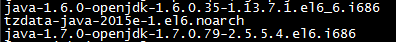

# 一、Tomcat、Jdk、mysql的安装
## 1.1 Tomcat的安装
* **步骤**
1. 上传Tomcat到linux上
2. 解压Tomcat到/usr/local目录下
3. 开放linux的对外访问的端口8080
```java
/sbin/iptables -I INPUT -p tcp --dport 8080 -j ACCEPT
```
4. 启动关闭Tomcat
    * 进入tomcat的bin下启动：./startup.sh
    * 进入tomcat的bin下关闭：./shutdown.sh
    * 
    * 

## 1.2 JDK的安装
* **步骤**
1. 查看当前Linux系统是否已经安装java；输入 **rpm -qa | grep java**
    * 

2. 卸载两个openJDK   输入rpm -e --nodeps 要卸载的软件
    * 

3. 上传jdk到linux
4. 安装jdk运行需要的插件yum install glibc.i686（选做，若不做，安装jdk的时候报缺少什么错就安装什么即可）
5. 解压jdk到/usr/local下：tar –xvf jdk-7u71-linux-i586.tar.gz –C /usr/local
6. 配置jdk环境变量，打开/etc/profile配置文件，将下面配置拷贝进去或者如图所示
```java
  #set java environment
  JAVA_HOME=/usr/local/jdk1.7.0_71
  CLASSPATH=.:$JAVA_HOME/lib.tools.jar
  PATH=$JAVA_HOME/bin:$PATH
  export JAVA_HOME CLASSPATH PATH
```


7. 重新加载/etc/profile配置文件：source /etc/profile

## 1.3 Mysql安装
* **步骤**
1. 查看CentOS自带的mysql；输入 rpm -qa | grep mysql


2. 将自带的mysql卸载


3. 上传Mysql到linux
4. 安装mysql的依赖（可跳过此步，往下安装的时候缺少什么就安装什么即可）
```java
um -y install libaio.so.1 libgcc_s.so.1 libstdc++.so.6
yum  update libstdc++-4.4.7-4.el6.x86_64
```
5. 解压Mysql到/usr/local/下的mysql目录(mysql目录需要手动创建)内
```java
cd /usr/local
mkdir mysql
tar -xvf MySQL-5.6.22-1.el6.i686.rpm-bundle.tar -C /usr/local/mysql
```
6. 在/usr/local/mysql下安装mysql
    * 安装服务器端：rpm -ivh MySQL-server-5.6.22-1.el6.i686.rpm
    * 安装客户端：rpm -ivh MySQL-client-5.6.22-1.el6.i686.rpm
7. 启动mysql：service mysql start
8. 将mysql加到系统服务中并设置开机启动
    * 加入到系统服务：chkconfig --add mysql
    * 自动启动：chkconfig mysql on
9. 登录mysql
    * mysql安装好后会生成一个临时随机密码，存储位置在/root/.mysql_secret
    * 
    * msyql –u root -p

10. 修改mysql的密码：set password = password('root');
11. 开启mysql的远程登录
    * 默认情况下mysql为安全起见，不支持远程登录mysql，所以需要设置开启    远程登录mysql的权限登录mysql后输入如下命令：
    ```java
    grant all privileges on *.* to 'root' @'%' identified by 'root';
    flush privileges;
    ```
12. 开放Linux的对外访问的端口3306
    * /sbin/iptables -I INPUT -p tcp --dport 3306 -j ACCEPT
    * /etc/rc.d/init.d/iptables save ---将修改永久保存到防火墙中
    * 
