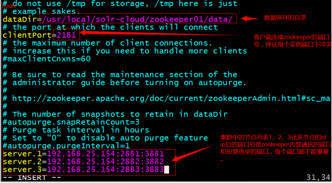

# <center>Zookeeper的介绍及安装使用</center>
# 一、Zookeeper的介绍
&emsp;&emsp;ZooKeeper是一个分布式的，开放源码的分布式应用程序协调服务，是Google的Chubby一个开源的实现，是Hadoop和Hbase的重要组件。它是一个为分布式应用提供一致性服务的软件，提供的功能包括：配置维护、域名服务、分布式同步、组服务等。ZooKeeper的目标就是封装好复杂易出错的关键服务，将简单易用的接口和性能高效、功能稳定的系统提供给用户。ZooKeeper包含一个简单的原语集，提供Java和C的接口。ZooKeeper代码版本中，提供了分布式独享锁、选举、队列的接口，代码在zookeeper-3.4.3\src\recipes。其中分布锁和队列有Java和C两个版本，选举只有Java版本。

# 二、Zookeeper的安装
**安装环境**：linux：6.4 jdk1.7<br>

## 2.1 单机版安装步骤
  * 第一步：安装jdk
  * 第二步：把zookeeper的压缩包上传到linux系统。
  * 第三步：解压缩压缩包
    ```
    tar -zxvf zookeeper-3.4.6.tar.gz
    ```
  * 第四步：进入zookeeper-3.4.6目录，创建data文件夹。
  * 第五步：把zoo_sample.cfg改名为zoo.cfg
  * 第六步：修改配置文件zoo.cfg中pata属性：dataDir=/root/zookeeper-3.4.6/data
  * 第七步：启动zookeeper
    ```
    启动：[root@localhost bin]# ./zkServer.sh start
    关闭：[root@localhost bin]# ./zkServer.sh stop
    查看状态：[root@localhost bin]# ./zkServer.sh status
    注意：需要关闭防火墙
    ```
## 2.1 Zookeeper集群搭建(伪分布式)
  * 第一步：需要安装jdk环境。
  * 第二步：把zookeeper的压缩包上传到服务器。
  * 第三步：解压缩。
  * 第四步：把zookeeper复制三份。
    ```
    [root@localhost ~]# mkdir /usr/local/solr-cloud
    [root@localhost ~]# cp -r zookeeper-3.4.6 /usr/local/solr-cloud/zookeeper01
    [root@localhost ~]# cp -r zookeeper-3.4.6 /usr/local/solr-cloud/zookeeper02
    [root@localhost ~]# cp -r zookeeper-3.4.6 /usr/local/solr-cloud/zookeeper03
    ```
  * 第五步：在每个zookeeper目录下创建一个data目录。
  * 第六步：在每个zookeeper目录下的data目录下创建一个myid文件，文件名就叫做“myid”。内容就是每个实例的id。例如1、2、3
    ```
    [root@localhost data]# echo 1 >> myid
    [root@localhost data]# cat myid
    1
    ```
  * 第七步：修改配置文件。把conf目录下的zoo_sample.cfg文件改名为zoo.cfg
  
  * 第八步：启动每个zookeeper实例。
  * 查看zookeeper的状态： bin/zkServer.sh status
