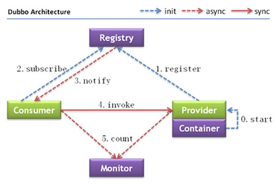
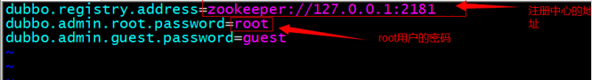

# <center>dubbo的简介及使用</center>

  **如何实现远程通信？**

-   Webservice：效率不高基于soap协议。项目中不推荐使用。
-   使用restful形式的服务：http+json。很多项目中应用。如果服务太多，服务之间调用关系混乱，需要治疗服务。
-   使用dubbo。使用rpc协议进行远程调用，直接使用socket通信。传输效率高，并且可以统计出系统之间的调用关系、调用次数。

# 一、什么是dubbo？

&emsp;&emsp;Dubbo是阿里巴巴SOA服务化治理方案的核心框架，每天为2,000+个服务提供3,000,000,000+次访问量支持，并被广泛应用于阿里巴巴集团的各成员站点。<br>
&emsp;&emsp;Dubbo\[]是一个分布式服务框架，致力于提供高性能和透明化的RPC远程服务调用方案，以及SOA服务治理方案。<br>
&emsp;&emsp;其核心部分包含:

-   远程通讯: 提供对多种基于长连接的NIO框架抽象封装，包括多种线程模型，序列化，以及“请求-响应”模式的信息交换方式。
-   集群容错: 提供基于接口方法的透明远程过程调用，包括多协议支持，以及软负载均衡，失败容错，地址路由，动态配置等集群支持。
-   自动发现: 基于注册中心目录服务，使服务消费方能动态的查找服务提供方，使地址透明，使服务提供方可以平滑增加或减少机器。

## 1.1 Dubbo能做什么？

-   透明化的远程方法调用，就像调用本地方法一样调用远程方法，只需简单配置，没有任何API侵入.
-   软负载均衡及容错机制，可在内网替代F5等硬件负载均衡器，降低成本，减少单点。
-   服务自动注册与发现，不再需要写死服务提供方地址，注册中心基于接口名查询服务提供者的IP地址，并且能够平滑添加或删除服务提供者。

# 二、Dubbo的架构



**节点角色说明：**

-   **Provider**: 暴露服务的服务提供方。
-   **Consumer**: 调用远程服务的服务消费方。
-   **Registry**: 服务注册与发现的注册中心。
-   **Monitor**: 统计服务的调用次调和调用时间的监控中心。
-   **Container**: 服务运行容器。

**调用关系说明：**
0. 服务容器负责启动，加载，运行服务提供者。
1. 服务提供者在启动时，向注册中心注册自己提供的服务。
2. 服务消费者在启动时，向注册中心订阅自己所需的服务。
3. 注册中心返回服务提供者地址列表给消费者，如果有变更，注册中心将基于长连接推送变更数据给消费者。
4. 服务消费者，从提供者地址列表中，基于软负载均衡算法，选一台提供者进行调用，如果调用失败，再选另一台调用。
5. 服务消费者和提供者，在内存中累计调用次数和调用时间，定时每分钟发送一次统计数据到监控中心。

# 三、Dubbo的使用方法

&emsp;&emsp;Dubbo采用全Spring配置方式，透明化接入应用，对应用没有任何API侵入，只需用Spring加载Dubbo的配置即可，Dubbo基于Spring的Schema扩展进行加载。_这里使用zookeeper来集中管理配置文件，安装及使用方法在zookeeper中有介绍！_

## 3.1 maven中引入dubbo的相关依赖
```xml
<!-- dubbo相关 -->
<dependency>
  <groupId>com.alibaba</groupId>
  <artifactId>dubbo</artifactId>
  <exclusions>
    <exclusion><!--除去自带的springjar包以及netty组件-->
      <groupId>org.springframework</groupId>
      <artifactId>spring</artifactId>
    </exclusion>
    <exclusion>
      <groupId>org.jboss.netty</groupId>
      <artifactId>netty</artifactId>
    </exclusion>
  </exclusions>
</dependency>
<!--zookeeper相关的依赖-->
<dependency>
  <groupId>org.apache.zookeeper</groupId>
  <artifactId>zookeeper</artifactId>
</dependency>
<dependency>
  <groupId>com.github.sgroschupf</groupId>
  <artifactId>zkclient</artifactId>
</dependency>
```

## 3.2 在spring的配置文件中添加dubbo的约束，然后使用dubbo:service发布服务

```xml
<?xml version="1.0" encoding="UTF-8"?>
<beans xmlns="http://www.springframework.org/schema/beans"
	xmlns:context="http://www.springframework.org/schema/context" xmlns:p="http://www.springframework.org/schema/p"
	xmlns:aop="http://www.springframework.org/schema/aop" xmlns:tx="http://www.springframework.org/schema/tx"
	xmlns:dubbo="http://code.alibabatech.com/schema/dubbo" xmlns:xsi="http://www.w3.org/2001/XMLSchema-instance"
	xsi:schemaLocation="http://www.springframework.org/schema/beans http://www.springframework.org/schema/beans/spring-beans-4.2.xsd
	http://www.springframework.org/schema/context http://www.springframework.org/schema/context/spring-context-4.2.xsd
	http://www.springframework.org/schema/aop http://www.springframework.org/schema/aop/spring-aop-4.2.xsd http://www.springframework.org/schema/tx http://www.springframework.org/schema/tx/spring-tx-4.2.xsd
	http://code.alibabatech.com/schema/dubbo http://code.alibabatech.com/schema/dubbo/dubbo.xsd
	http://www.springframework.org/schema/util http://www.springframework.org/schema/util/spring-util-4.2.xsd">

	<context:component-scan base-package="com.baidu.www"></context:component-scan>

  <!-- 使用dubbo发布服务，以下配置文件为服务提供者的配置文件 -->
  <!-- 提供方应用信息，用于计算依赖关系 -->
  <!-- 设置服务发布的名称 -->
  <dubbo:application name="applicationName" />
  <!-- 设置中介（注册中心）zookeeper  redis-->
  <dubbo:registry protocol="zookeeper"
    address="192.168.25.154:2181,192.168.25.154:2182,192.168.25.154:2183" />
  <!-- 用dubbo协议在20880端口暴露服务 -->
  <dubbo:protocol name="dubbo" port="20880" />
  <!-- 声明需要暴露的服务接口 -->
  <dubbo:service interface="com.baidu.www.service.AppService" ref="appServiceImpl" />


  <!-- 引用dubbo服务，以下配置文件为消费者的配置文件 -->
  <!-- 设置引用dubbo服务的应用名称 -->
  <dubbo:application name="useApplicationName"/>
  <!-- 连接到zookeeper上 -->
  <dubbo:registry protocol="zookeeper" address="192.168.25.154:2181,192.168.25.154:2182,192.168.25.154:2183"/>
  <!--在maven中需要引入服务提供者提供的接口所在的项目的jar包，这样消费者在spring初始化的时候才会对引用的接口初始化bean，其对应的id为类名首字母小写，即可用如下id注入，完成调用-->
  <dubbo:reference interface="com.baidu.www.service.AppService" id="AppService" />
</beans>
```

# 四、Dubbo监控中心
&emsp;&emsp;在github上查看Dubbo监控的源码：https://github.com/apache/incubator-dubbo-ops ，部署教程：https://github.com/apache/incubator-dubbo-ops/blob/develop/README_ZH.md 。也可以从 https://download.csdn.net/download/evankaka/9054273 上下载war包直接部署到tomcat上运行。如果监控中心和注册中心在同一台服务器上，可以不需要任何配置，如果不在同一台服务器，需要修改配置文件：dubbo.properties，解压后war包下
<br>
启动zookeeper<br>
启动tomcat<br>
访问http://localhost:8088/dubbo-admin-2.5.4-SNAPSHOT/ 一定要注意名一定要和你webapp下的工程名保持一致！


Continue。
