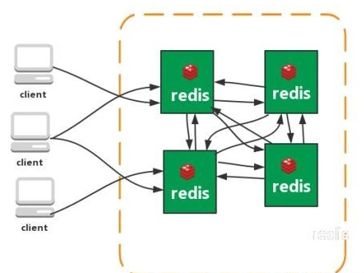

# 一、Redis
* redis的优点：
    1. 对数据高并发读写
    2. 对海量数据的高效率存储和访问
    3. 对数据的可扩展性和高可用性
* redis的缺点：
    1. redis（ACID处理非常简单），无法做到太复杂的关系数据库模型

# 二、Redis单机版的安装

1. 安装gcc的编译环境

   **yum install gcc-c++**
2. 把redis的源码上传到linux服务器
3. 解压

   **tar -zxvf redis-3.3.3.tar.gz**
4. 执行make

   **make**
5. 安装到指定的路径

   **make install PREFIX=/usr/local/redis**
6. 启动redis的安装

   redis有两种启动方式：前端启动，后端启动

   前端启动：到redis下的文件夹下的bin目录执行:

   **./redis-server**

   后端启动：复制redis.conf到redis的安装目录——修改redis.conf（把daemonize no 改为 demonize yes)——启动：
   

   **./redis-server redis.conf**
7. 客户端

   redis-cli -p【端口】 -h ip地址 <-c>连接集群时使用此参数默认端口：6379 默认ip：localhost（127.0.0.1）。客户端工具：RedisDesktopManager(只能连接单机版的redis，不能连接集群)

# 三、Redis集群版的安装
## 3.1 架构细节
1. 所有的redis节点彼此互联(PING-PONG机制),内部使用二进制协议优化传输速度和带宽.
2. 节点的fail是通过集群中超过半数的节点检测失效时才生效.
3. 客户端与redis节点直连,不需要中间proxy层.客户端不需要连接集群所有节点,连接集群中任何一个可用节点即可
4. redis-cluster把所有的物理节点映射到[0-16383]slot上,cluster 负责维护node<->slot<->value Redis 集群中内置了 16384 个哈希槽，当需要在 Redis 集群中放置一个 key-value 时，redis 先对key 使用 crc16 算法算出一个结果，然后把结果对 16384 求余数，这样每个 key 都会对应一个编号在0-16383 之间的哈希槽，redis 会根据节点数量大致均等的将哈希槽映射到不同的节点。

## 3.2 集群搭建
集群中应该至少有三个节点，每个节点有一备份节点。需要6台服务器。搭建伪分布式，需要6个redis实例。

**搭建集群的步骤：**
1. 创建6个redis实例指定端口从7001到7006
2. 修改redis.conf 打开Cluster-enable yes前面的注释。
3. 需要一个ruby脚本。在redis源码文件夹下的src目录下。redis-trib.rb。也可直接yum下载。
4. 把redis-trib.rb文件复制到到redis-cluster目录下。
5. 执行ruby脚本之前，需要安装ruby环境。
* **yum install ruby**
* **yum install rubygems**
* 安装redis-trib.rb运行依赖的ruby的包。若没有如下的安装包，则执行命令亦可：**gem install redis**
 

6. 启动所有的redis实例。
7. 使用redis-trib.rb创建集群。

    ./redis-trib.rb create --replicas 1 192.168.25.153:7001 192.168.25.153:7002 192.168.25.153:7003 192.168.25.153:7004 192.168.25.153:7005 192.168.25.153:7006

    使用客户端连接集群： redis01/redis-cli -p 7001 -c
# 四、Redis 主从同步
## 4.1 Redis主从复制简介
* Redis 支持将数据同步到多台从库上，这种特性对提高读取性能非常有益。
1. master可以有多个slave。
2. 除了多个slave连到相同的master外，slave也可以连接其它slave形成图状结构。
3. 主从复制不会阻塞master。也就是说当一个或多个slave与master进行初次同步数据时，master可以继续处理客户端发来的请求。相反slave在初次同步数据时则会阻塞不能处理客户端的请求。
4. 主从复制可以用来提高系统的可伸缩性，我们可以用多个slave专门用于客户端的读请求，比如sort操作可以使用slave来处理。也可以用来做简单的数据冗余。
5. 可以在master禁用数据持久化，只需要注释掉master配置文件中的所有save配置，然后只在slave上配置数据持久化。

## 4.2 Redis主从复制的过程介绍
* 当设置好slave服务器后，slave会建立和master的连接，然后发送sync命令。无论是第一次同步建立的连接还是连接断开后的重新连接，master都会启动一个后台进程，将数据库快照保存到文件中，同时master就发送文件给slave，slave将文件保存到磁盘上，然后加载到内存恢复数据库快照到slave上。接着master就会把缓存的命令转发给slave。而且后续master收到的写命令都会通过开始建立的连接发送给slave。从master到slave的同步数据的命令和从客户端发送的命令使用相同的协议格式。当master和slave的连接断开时salve可以自动重新建立连接。如果master同时收到多个slave发来的同步连接命令，只会启动一个进程来写数据库镜像，然后发送给所有的slave。
* 配置slave服务器很简单，只需要在配置文件中添加如下配置：slaveof 192.168.1.1 6379 #指定master的ip和端口号

# 五、Redis 的架构模式
## 5.1 单机版

特点：简单

问题： 1、内存容量有限 2、处理能力有限 3、无法高可用。

## 5.2 主从复制

Redis 的复制（replication）功能允许用户根据一个 Redis 服务器来创建任意多个该服务器的复制品，其中被复制的服务器为主服务器（master），而通过复制创建出来的服务器复制品则为从服务器（slave）。 只要主从服务器之间的网络连接正常，主从服务器两者会具有相同的数据，主服务器就会一直将发生在自己身上的数据更新同步 给从服务器，从而一直保证主从服务器的数据相同。

特点：

1、master/slave 角色

2、master/slave 数据相同

3、降低 master 读压力在转交从库

问题：

无法保证高可用

没有解决 master 写的压力

## 5.3 哨兵

Redis sentinel 是一个分布式系统中监控 redis 主从服务器，并在主服务器下线时自动进行故障转移。其中三个特性：

监控（Monitoring）：    Sentinel  会不断地检查你的主服务器和从服务器是否运作正常。

提醒（Notification）： 当被监控的某个 Redis 服务器出现问题时， Sentinel 可以通过 API 向管理员或者其他应用程序发送通知。

自动故障迁移（Automatic failover）： 当一个主服务器不能正常工作时， Sentinel 会开始一次自动故障迁移操作。

特点：

1、保证高可用

2、监控各个节点

3、自动故障迁移

缺点：主从模式，切换需要时间丢数据

没有解决 master 写的压力

## 5.4 集群（proxy 型）

Twemproxy 是一个 Twitter 开源的一个 redis 和 memcache 快速/轻量级代理服务器； Twemproxy 是一个快速的单线程代理程序，支持 Memcached ASCII 协议和 redis 协议。

特点：1、多种 hash 算法：MD5、CRC16、CRC32、CRC32a、hsieh、murmur、Jenkins

2、支持失败节点自动删除

3、后端 Sharding 分片逻辑对业务透明，业务方的读写方式和操作单个 Redis 一致

缺点：增加了新的 proxy，需要维护其高可用。

failover 逻辑需要自己实现，其本身不能支持故障的自动转移可扩展性差，进行扩缩容都需要手动干预

## 5.5 集群（直连型）

从redis 3.0之后版本支持redis-cluster集群，Redis-Cluster采用无中心结构，每个节点保存数据和整个集群状态,每个节点都和其他所有节点连接。

特点：

1、无中心架构（不存在哪个节点影响性能瓶颈），少了 proxy 层。

2、数据按照 slot 存储分布在多个节点，节点间数据共享，可动态调整数据分布。

3、可扩展性，可线性扩展到 1000 个节点，节点可动态添加或删除。

4、高可用性，部分节点不可用时，集群仍可用。通过增加 Slave 做备份数据副本

5、实现故障自动 failover，节点之间通过 gossip 协议交换状态信息，用投票机制完成 Slave到 Master 的角色提升。

缺点：

1、资源隔离性较差，容易出现相互影响的情况。

2、数据通过异步复制,不保证数据的强一致性

详情请参考：https://www.cnblogs.com/jasontec/p/9699242.html

# 六、Redis 持久化
* Redis提供了多种不同级别的持久化方式:一种是RDB,另一种是AOF.
RDB 持久化可以在指定的时间间隔内生成数据集的时间点快照（point-in-time snapshot）。

* AOF 持久化记录服务器执行的所有写操作命令，并在服务器启动时，通过重新执行这些命令来还原数据集。AOF 文件中的命令全部以 Redis 协议的格式来保存，新命令会被追加到文件的末尾。 Redis 还可以在后台对 AOF 文件进行重写（rewrite），使得 AOF 文件的体积不会超出保存数据集状态所需的实际大小。
Redis 还可以同时使用 AOF 持久化和 RDB 持久化。 在这种情况下， 当 Redis 重启时， 它会优先使用 AOF 文件来还原数据集， 因为 AOF 文件保存的数据集通常比 RDB 文件所保存的数据集更完整。你甚至可以关闭持久化功能，让数据只在服务器运行时存在。
* 了解 RDB 持久化和 AOF 持久化之间的异同是非常重要的， 以下几个小节将详细地介绍这这两种持久化功能， 并对它们的相同和不同之处进行说明。

## 6.1 RDB 的优点:
* RDB 是一个非常紧凑（compact）的文件，它保存了 Redis 在某个时间点上的数据集。 这种文件非常适合用于进行备份： 比如说，你可以在最近的 24 小时内，每小时备份一次 RDB 文件，并且在每个月的每一天，也备份一个 RDB 文件。 这样的话，即使遇上问题，也可以随时将数据集还原到不同的版本。RDB 非常适用于灾难恢复（disaster recovery）：它只有一个文件，并且内容都非
常紧凑，可以（在加密后）将它传送到别的数据中心，或者亚马逊 S3 中。RDB 可以最大化 Redis的性能：父进程在保存 RDB 文件时唯一要做的就是 fork 出一个子进程，然后这个子进程就会处理接下来的所有保存工作，父进程无须执行任何磁盘 I/O 操作。RDB 在恢复大数据集时的速度比 AOF 的恢复速度要快。

## 6.2 RDB 的缺点:
* 如果你需要尽量避免在服务器故障时丢失数据，那么 RDB 不适合你。 虽然 Redis 允许你设置不同的保存点（save point）来控制保存 RDB 文件的频率， 但是， 因为RDB 文件需要保存整个数据集的状态， 所以它并不是一个轻松的操作。 因此你可能会至少 5 分钟才保存一次 RDB 文件。 在这种情况下， 一旦发生故障停机， 你就可能会丢失好几分钟的数据。每次保存 RDB 的时候，Redis 都要 fork() 出一个子进程，并由子进程来进行实际的持久化工作。 在数据集比较庞大时， fork() 可能会非常耗时，造成服务器在某某毫秒内停止处理客户端； 如果数据集非常巨大，并且 CPU 时间非常紧张的话，那么这种停止时间甚至可能会长达整整一秒。 虽然AOF 重写也需要进行 fork() ，但无论 AOF 重写的执行间隔有多长，数据的耐久性都不会有任何损失。

## 6.3 AOF的优点:
* 使用 AOF 持久化会让 Redis 变得非常耐久（much more durable）：你可以设置不同的fsync 策略，比如无 fsync ，每秒钟一次 fsync ，或者每次执行写入命令时 fsync 。AOF 的默认策略为每秒钟 fsync 一次，在这种配置下，Redis 仍然可以保持良好的性能，并且就算发生故障停机，也最多只会丢失一秒钟的数据（ fsync 会在后台线程执行，所以主线程可以继续努力地处理命令请求）。AOF 文件是一个只进行追加操作的日志文件append only log）， 因此对 AOF 文件的写入不需要进行 seek ， 即使日志因为某些原因而包含了未写入完整的命令（比如写入时磁盘已满，写入中途停机，等等），redis-check-aof 工具也可以轻易地修复这种问题。

* Redis 可以在 AOF 文件体积变得过大时，自动地在后台对 AOF 进行重写： 重写后的新AOF 文件包含了恢复当前数据集所需的最小命令集合。 整个重写操作是绝对安全的，因为 Redis 在创建新 AOF 文件的过程中，会继续将命令追加到现有的 AOF 文件里面，即使重写过程中发生停机，现有的 AOF 文件也不会丢失。 而一旦新 AOF 文件创建完毕，Redis 就会从旧 AOF 文件切换到新 AOF 文件，并开始对新 AOF 文件进行追加操作。AOF 文件有序地保存了对数据库执行的所有写入操作， 这些写入操作以 Redis 协议的格式保存， 因此 AOF 文件的内容非常容易被人读懂， 对文件进行分析（parse）也很轻松。 导出（export） AOF 文件也非常简单： 举个例子， 如果你不小心执行了 FLUSHALL命令， 但只要 AOF 文件未被重写， 那么只要停止服务器， 移除 AOF 文件末尾的 FLUSHALL命令， 并重启 Redis ， 就可以将数据集恢复到 FLUSHALL 执行之前的状态。

## 6.4 AOF 的缺点:
* 对于相同的数据集来说，AOF 文件的体积通常要大于 RDB 文件的体积。根据所使用的 fsync 策略，AOF 的速度可能会慢于 RDB 。 在一般情况下， 每秒 fsync 的性能依然非常高， 而关闭 fsync 可以让 AOF 的速度和 RDB 一样快， 即使在高负荷之下也是如此。 不过在处理巨大的写入载入时，RDB 可以提供更有保证的最大延迟时间（latency）。AOF 在过去曾经发生过这样的 bug ： 因为个别命令的原因，导致 AOF 文件在重新载入时，无法将数据集恢复成保存时的原样。 （举个例子，阻塞命令 BRPOPLPUSH 就曾经引起过这样的 bug 。） 测试套件里为这种情况添加了测试： 它们会自动生成随机的、复杂的数据集， 并通过重新载入这些数据来确保一切正常。 虽然这种 bug 在 AOF 文件中并不常见， 但是对比来说， RDB 几乎是不可能出现这种 bug 的。
